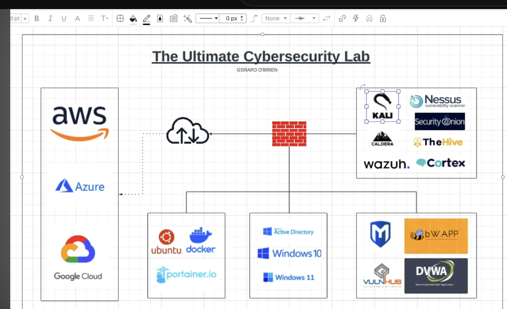
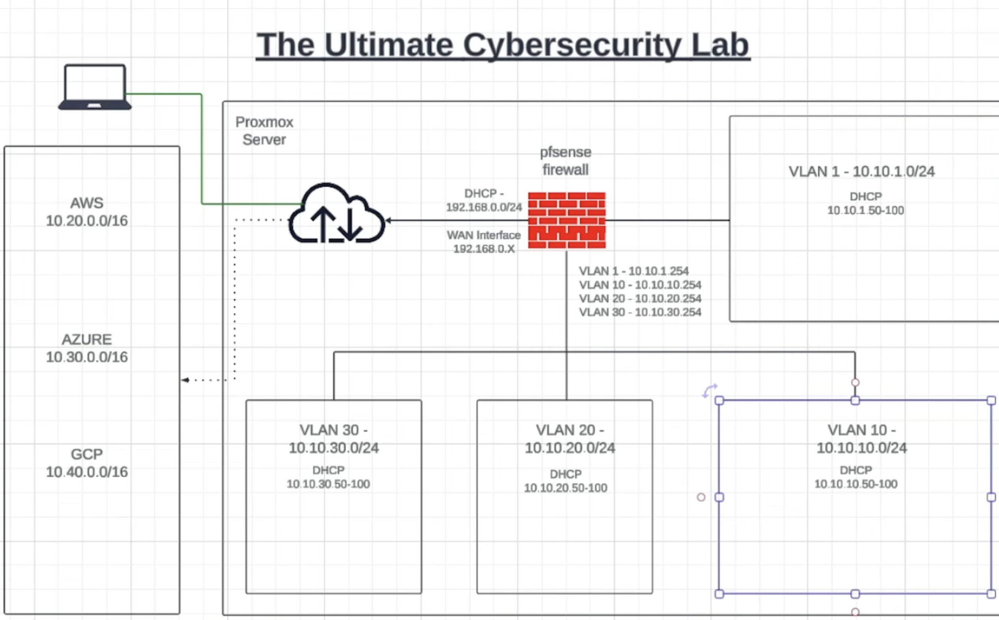

# Building and Operating a Segmented Homelab: VLAN Debugging, Remote Access, and Adding an Offensive-AI VLAN

*Network design adapted from a reference architecture by [Gerard O'Brien](https://www.youtube.com/watch?v=XIvn0ZDSmKA&list=PL3ljjyal211AbTqlxSo6CGBiVqsXw8wrp). The build, debugging, and fixes below are my own.*

**TL;DR:** This covers three phases of running the same lab. First, standing it up: a VM on a VLAN-tagged bridge failed to boot, then failed to get a DHCP lease, even though every visible pfSense and Proxmox setting was correct — traced hop-by-hop with `tcpdump` to stale tap-interface state a config review couldn't reveal. Getting the Kali VM into the SIEM was a second, unrelated failure chain (agent packaging, then a hand-edited XML syntax error). Second, a remote-access failure right before a live CTF that forced a fast, evidence-based decision under time pressure. Third, adding a new VLAN for an autonomous pentesting agent, where the actual engineering question was containment — not whether the tool worked, but what it could reach if it went wrong.

## Context

I built a segmented cybersecurity homelab on Proxmox — a pfSense firewall/router, multiple VLANs for trust-zone separation, and a tool stack (Kali, Wazuh, Security Onion, TheHive, Cortex, and others) split across them — based on a published reference architecture I adapted to my own hardware and Proxmox version. Standing it up surfaced a chain of problems that had nothing to do with the reference design being wrong, and everything to do with details that don't show up in a walkthrough: bridge configuration defaults, VLAN tagging behavior, and how Proxmox's virtual networking actually moves a tagged frame from a VM to a firewall VM.

**The reference design** (Gerard O'Brien's original architecture and tool stack):

*Reference design by [Gerard O'Brien](https://www.youtube.com/watch?v=XIvn0ZDSmKA&list=PL3ljjyal211AbTqlxSo6CGBiVqsXw8wrp) — not my own work, shown for context on what I built from.*

**My build** (IP scheme, VLANs, and DHCP ranges as actually deployed):

## Part 1: Standing It Up

### The First Failure: a VM That Wouldn't Boot

The first sign of trouble was mundane — a VM on the tools VLAN failed to start, with Proxmox reporting no physical interface on the bridge and a bridge network script failure. A second VM on the same bridge, with no VLAN tag set, started fine. That comparison was the actual diagnostic: the difference wasn't the VM, it was the tag.

The bridge itself wasn't configured as VLAN-aware. Proxmox will silently let you assign a VLAN tag to a VM's virtual NIC without the underlying bridge actually being able to interpret VLAN tags at all — the tag gets attached, but the bridge has no policy for what to do with it, and that mismatch was enough to prevent the VM from starting cleanly. The fix was adding `bridge-vlan-aware yes` to the bridge's definition in `/etc/network/interfaces` and reloading networking. The VM booted.

**What I didn't do:** the easy way out was to just drop the VLAN tag and avoid the problem — the initial suggestion I got when troubleshooting this. I didn't take it, because dropping the tag would have defeated the actual point of the exercise: trust-zone segmentation. A working VM on the wrong network isn't a fix.

### The Second Failure: Booted, No IP

With the VM running, the next problem was that it couldn't obtain a DHCP lease. This forced a methodical check of every layer between the VM and the DHCP server, because the obvious suspects (DHCP scope, firewall rule, VLAN-to-interface mapping) all turned out to be correctly configured:

- DHCP was enabled on the correct VLAN interface with the right address range.
- The firewall rule permitting traffic on that VLAN already existed.
- The VLAN was correctly bound to the firewall's LAN-side trunk interface.

Every piece of pfSense's configuration matched what it should have been. That's the uncomfortable case in networking troubleshooting — when the configuration you can see is correct, and the problem is somewhere you haven't looked yet.

### The Long Packet Trace

At that point I stopped trusting configuration review and started tracing the actual frame, hop by hop, with `tcpdump` at each layer:

1. **On the firewall's LAN interface**, filtering for the VLAN: zero packets arriving. So the problem was upstream of the firewall.
2. **On the Proxmox bridge's VLAN table** (`bridge vlan show`): the VLAN wasn't actually registered as a member of the bridge — everything was showing as untagged, PVID 1 only. I added the VLAN to the bridge and to the VM's tap interface manually.
3. **Still nothing** — even after disabling Proxmox's own per-VM firewall and fully power-cycling the VM (not just a reboot).
4. **A methodology correction along the way:** I'd been running `tcpdump` on the firewall VM itself for a VLAN whose tap interface actually lives on the Proxmox host, not inside the VM. Once I moved the capture to the host side, the traffic became visible.
5. **On the VM's own tap interface:** DHCP requests were leaving the VM — untagged. The VM's config still specified the VLAN tag, but the frame leaving the tap wasn't carrying it.
6. **On the bridge itself:** the same frame now showed up correctly tagged as 802.1Q VLAN traffic. So bridge-level tagging was actually working.
7. **On the firewall's own tap interface:** nothing. The tagged frame reached the bridge and never arrived at the firewall's side of the connection.

That's a genuinely confusing state to be in — every individual link in the chain looked correct in isolation, but the frame still didn't complete the path. The eventual fix was restarting the firewall VM itself, which recreated its own tap interfaces with correct VLAN membership. The interfaces Proxmox had built for that VM at boot time simply hadn't picked up the VLAN configuration changes made after it was already running — a stale-state problem, not a config-correctness problem, which is why reading the config back gave no indication anything was wrong.

**Making it durable:** a manually-run `bridge vlan add` command doesn't survive a reboot, so once the fix was confirmed, I moved it into the bridge's persistent configuration (a `post-up` hook) so a future reboot wouldn't silently regress the whole VLAN back to the same failure.

### The Third Failure: An Agent That Wouldn't Ship Logs

With networking solid, the next gap was operational: the Kali VM's activity wasn't showing up in the SIEM at all. This split into two separate problems that had to be isolated one at a time rather than assumed to be the same root cause:

**Getting a Wazuh agent onto the firewall itself** (to capture firewall-level events, not just the Kali host) turned out to be its own multi-step failure:
- The platform-specific agent package from the OS vendor's repo failed with a library-version mismatch — the firewall's underlying OS release was newer than what the packaged agent expected.
- Downloading the agent package directly from the vendor also failed (access denied on every URL tried).
- Building the agent from source hit a missing compiler, then a missing system header with no available package to provide it — a dead end for that install path on that specific OS version.
- I also caught, before wasting time on it, that installing an older agent version to work around the packaging gap would have created a version mismatch against the SIEM manager it needed to report to — not worth trading one failure for a subtler one.

**The actual fix was to stop trying to install a full agent and use syslog forwarding instead** — a lighter integration the firewall supported natively. That path had its own failure: hand-editing the SIEM manager's XML configuration to add the syslog input introduced small, hard-to-spot syntax errors (a stray closing tag, a malformed attribute, a block placed outside its enclosing section). The service's own error output on restart was vague — effectively just "config didn't load" with a process name and a signal number, no line reference. Running an XML linter against the file directly pointed at the exact malformed lines, which the service's own logging never did.

## Part 2: A Remote-Access Failure Under Time Pressure

A few weeks after the lab was stable, I lost remote access to it right before I needed to leave for an in-person CTF competition — the Proxmox web UI and SSH were both unreachable over my Tailscale connection to the lab.

Rather than start debugging Tailscale itself with the clock running, I checked one thing first: whether SSH still worked over the lab's local network address. It did. That single check answered the only question that actually mattered in the moment — I was still physically at home, with a window to fix Tailscale (or fall back to local access if I couldn't) before leaving, rather than being locked out remotely with no way to intervene until I got back.

**Why this is worth including even though it's a small incident:** it's a decision-making example, not just a networking one. Under time pressure, the fastest useful action wasn't "start troubleshooting the failing thing" — it was "establish what I can still do," which reframed a scary "I'm locked out" moment into a bounded, known problem with time to address it.

## Part 3: Adding an Autonomous Pentesting Tool Without Widening the Blast Radius

Later, I added PENTagi (an autonomous AI-driven penetration-testing agent) to the lab. The interesting engineering question wasn't installation — it was where it should live on the network.

The lab already had a VLAN dedicated to manual offensive tooling (Kali and similar). The obvious shortcut would have been to drop PENTagi onto that same VLAN — it's already the "attack tools" zone, so why not. I didn't do that, because that VLAN's existing firewall rules were written for a human operator, not an autonomous agent. An autonomous tool that can chain actions on its own is a materially different risk than a human running the same tools by hand: it can act faster, longer, and without a person watching each step to notice something has gone wrong.

**The actual fix:** a new, dedicated VLAN, with an explicit default posture:
- **Blocked outbound** to every other VLAN in the lab, by default.
- **Allowed outbound to the internet**, since the tool needs it to function.
- **Temporary, explicit allow rules** added only while actively testing against a specific target VLAN, and removed afterward rather than left standing.

The design principle was containment-first: assume the tool could misbehave, and make sure "misbehaving" has nowhere to go except the one path I'd deliberately opened, for only as long as I needed it open.

## Finding

The pattern across the Part 1 failures was consistent: **the configuration that was visible was correct, and the actual fault was in state that isn't visible from reading a config file** — a bridge that hadn't been told it was VLAN-aware, tap interfaces that had gone stale relative to a config change made after boot, an XML typo a generic error message couldn't localize. None of these were "the tutorial was wrong" problems. They were "the tutorial's environment had different defaults or state than mine" problems, which is a different and more useful thing to get good at diagnosing.

The later phases were a different kind of lesson: Part 2 was about what to do when you don't have time to fully diagnose a problem — establish the boundary of what's actually broken before trying to fix it. Part 3 was about treating a new tool's *default* network placement as a design decision with real consequences, not a convenience choice — especially once the tool is autonomous rather than human-operated.

## Impact / Skills Demonstrated

- **Systematic layer-by-layer packet tracing** (`tcpdump` at each hop, `bridge vlan show` for switch-level state) to localize a fault to a specific link in a multi-hop path, rather than guessing at the most likely culprit.
- **Distinguishing configuration-correctness from runtime-state problems** — every config value was right, and the fix was a service restart to reconcile stale interface state, a failure mode that config review alone cannot catch.
- **Isolating compound failures instead of treating them as one problem** — the SIEM-visibility issue was actually two independent failures (agent packaging/build environment, then a hand-edited config syntax error) that needed separate root-causing rather than one fix.
- **Recognizing a dead-end path early** — catching a potential agent/manager version mismatch before installing it, and abandoning a source-build path that had no viable route forward on that OS version, rather than continuing to force a specific solution past the point it made sense.
- **Making fixes durable, not just working** — moving a manually-applied VLAN fix into persistent configuration so it would survive a reboot, instead of leaving a fix that only worked until the next restart.
- **Triaging under time pressure** — establishing what still worked (local access) before diagnosing what didn't (remote access), to turn an unbounded problem into a bounded one before a hard deadline.
- **Threat-modeling a new tool by its behavior, not its category** — recognizing that an autonomous agent needed stricter network containment than a human running the same class of tools, and designing a default-deny VLAN with narrow, temporary exceptions rather than reusing an existing zone out of convenience.

**Technologies:** Proxmox VE (bridge/VLAN networking), pfSense, 802.1Q VLAN tagging, `tcpdump`, Wazuh (agent and manager), syslog, XML configuration debugging, Tailscale, PENTagi (autonomous pentesting agent).
